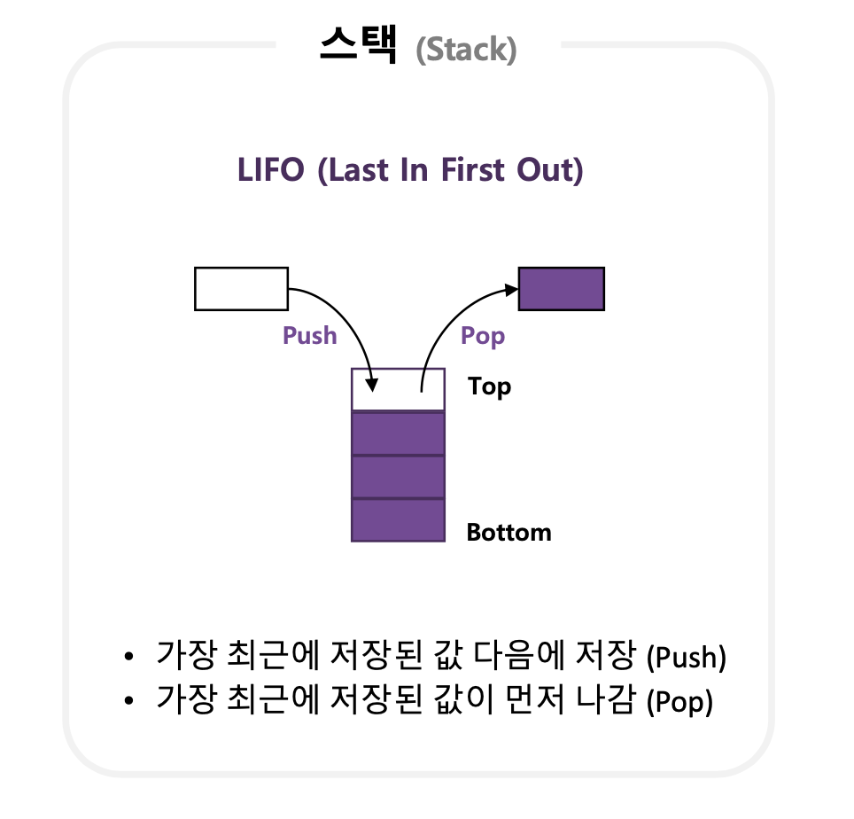

# 스택 (Stack)

___

### 스택(stack) ?

* <span style="color:red">**First in Last out**</span>
* 한쪽 끝이 막힌 형태 (예: 한쪽 끝이 막힌 주차장 )
* 입구가 하나라서 먼저 들어간 것이 갖아 나중에 나오는 '선입후출,  후입선출 '


#### 스택의 원리?

##### 1. 스택의 기본 구조‼️

* 스택에 데이터를 삽입 : push
* 스택에 데이터를 추출 : pop
* 스택에 들어 있는 가장 위의 데이터 : top 



___


#### 1. 스택 생성

```python
# 예시 : 4개의 빈 스택 만들기 

stack = [None, None, None, None] 
top = -1 # stack 초깃값 
```

```python
# 함수의 전역 변수 사용시

SIZE = 숫자
stack = [None for _ in range(SIZE)]
top = -1
```


#### 2. 데이터 삽입 (push)

* 스택이 꽉 찼는지 확인 ✅
  * top 값이 **스택 크키 -1**과 같다면 스택이 꽉 찬 상태

```python
def isStackfull():
  global SIZE, stack,top:
    if (top >=SIZE -1)
    return True
  else :
    return False
```

```python
def push(data):
  if(isStackFull()):
    print('Stack is full')
    return
  else:
    top +=1
    stack[top] = data
```


#### 3. 데이터 추출 (pop)

* 스택이 비었는지 확인 ✅
  * top 값이 -1(초깃값)이라면 비어 있음 

```python
def isStackEmpty():
  if (top == -1):
    return True
  else:
    return False
```

```python
def pop(data):
  if (isStackEmpty()):
    print('Stack is Empty')
    return None
  else:
    data = stack[top]
    stack[top] = None				# data를 추출한 자리를 청소 해준다는 느낌
    top -= 1
    return data
    
```


#### 4. 데이터 확인 (peek)

```python
def peek():
  if (isStackEmpty()):
    print('Stack is Empty')
    return None
  return stack[top]
```

___

##### 참고자료

1. [IT Cook Book, 파이썬 자료구조와 알고리즘 for Beginner](https://www.hanbit.co.kr/store/books/look.php?p_code=B4186876690)

2. [Image](https://velog.io/@awesomeo184/%EC%9E%90%EB%A3%8C%EA%B5%AC%EC%A1%B0-%EC%8A%A4%ED%83%9D)

   


