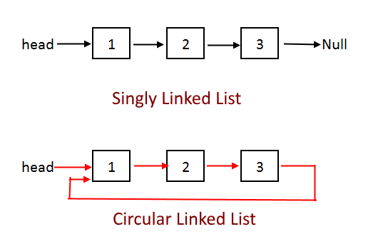
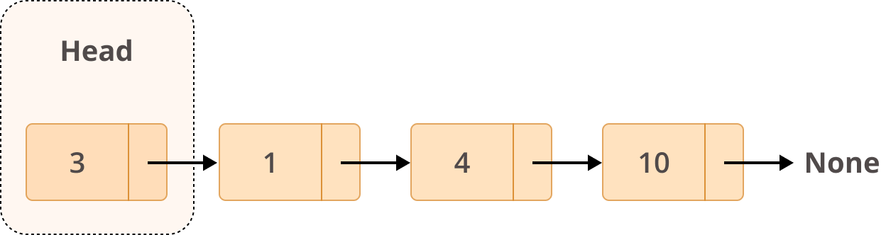

# 연결 리스트 (단순, 원형)

___

### 단순 연결 리스트(Singly Linked List)?

* 노드들이 물리적으로 떨어진 곳에 위치
* 각 노드의 번지도 순차적이지 않음 
* 화살표 (링크, Link)를 따라가면 선형 리스트 순서와 같음 


### 원형 연결 리스트(Circular Linked List)?

* 시작 위치와 다음 위치가 계속 이어진 후 마지막에 **다시 시작**  으로 돌아오는 형태

* 단순 연결 리스트와 구조와 구현 코드가 유사함

* 리스트 형태가 원(Circle)형태로 구성

* 오버헤드가 발생하지 않음 

  


#### 선형 리스트와 단순연결 리스트의 데이터 삽입/ 삭제 방법 비교

* 선형 리스트 : 데이터의 양이 방대 할 때는 '오버헤드' 발생 할 수 있음 
* 단순 연결 리스트 : 해당 노드의 앞뒤 링크만 수정하면 되며 오버헤드 발생률이 낮음


#### 노드(Node) 와 단순 연결 리스트의 형태 

* <span style="color:blue">**데이터 + 링크**</span> 로 구성된 항목 

* **Head** :  노드가 시작하는 시작 점 (첫번째 노드)

* **Current** : 지금 처리 중인 노드

* **Pre** : 현재 처리 중인 노드의 바로 앞, 이전 노드 

* **Link**  : 화살표 

* **마지막 노드** : link 없음 

  * 원형 연결리스트의 경우에는 마지막 노드의 link는 head 로 이동! 

  

  


___

#### 1. 노드 생성과 연결  (단순 연결리스트)

```python
# 클래스 문법을 사용하여 Node 데이터형 정의
# 함수 완성본 : Code04-08.ipynb
class Node():
  def __init__(self):				# 데이터형을 생성할 때 자동으로 실행되는 부분 
    self.data = None				# 데이터와 링크가 저장되는 부분 
    self.link = None
```


#### 1b. 노드 생성과 연결 (원형 연결리스트)

```python
class Node():
  def __init__(self):				# 데이터형을 생성할 때 자동으로 실행되는 부분 
    self.data = None				# 데이터와 링크가 저장되는 부분 
    self.link = None
    
node = Node()
node.link = node
```


#### 2. 단순 연결리스트 생성 함수

```python
# 노드가 없을때 까지 반복 (끝)
def printNodes(start):
  current = start 
  print(current.data, end='')
  while (current.link != None):
    current = current.link
    print(current.data, end='')
 	print()
```

 

#### 3-1.  단순 연결 리스트의 노드 삽입  (첫번째 노드)

```python
# 첫번째 노드에 삽입 
def insertNode(findData,insertData):
  global memory, head, current, pre
  if head.data == findData:
    node = Node()
    node.data = insertData
    node.link = head
    head = node
    memory.append(node)
    return 
```

#### 3-2. 단순 연결 리스트의 노드 삽입  (중간 노드)

```python
current= head
# 기존 노드를 임시 저장 
while current.link != None:
  pre = current									# current와 함께 이동하며 판단 
  current = current.link
  if current.data == findData:
    node=Node()
    node.data = insertData
    node.link = current
    pre.link = node
    memory.append(node)
    return 
  
```

#### 3-3 단순 연결 리스트의 노드 삽입 (마지막 노드)

```python
node= Node()
noe.data= insertData
current.link = node
memory.append(node)
return 
```


#### 4-1. 단순 연결 리스트 노드 삭제 (첫 번째 노드)

```python
def deleteNode(deleteData):
  global memory, head, current, pre
  if head.data == deleteData:
    current = head
    head = head.link
    del(current)
```


#### 4-2 단순 연결 리스트 노드 삭제 (첫번째 제외)

```python
current= head
while current.link != None:
  pre = current									# 옮기면서 확인 중
  current = current.link
  if current.data == deleteData:
    pre.link = current.link
    del(current)
    return
```


#### 5. 단순 연결 리스트 노드 검색

```python
def findNode(findData):
    global memory,head, current, pre
    current = head
    if head.data == findData:
      return current
    
    while current.link != None:
      current = current.link
      if current.link == findData:
        return current
    return Node()
```


____

##### 참고자료

1. [IT Cook Book, 파이썬 자료구조와 알고리즘 for Beginner](https://www.hanbit.co.kr/store/books/look.php?p_code=B4186876690)

2. [사진](https://algorithms.tutorialhorizon.com/circular-linked-list-complete-implementation/)

3. [사진](https://realpython.com/linked-lists-python/)

   