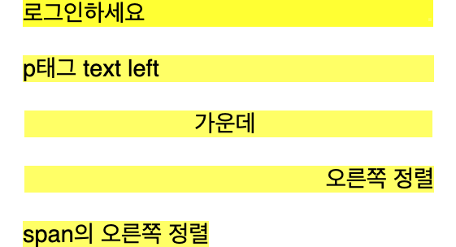
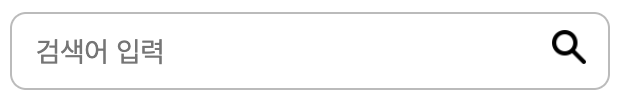
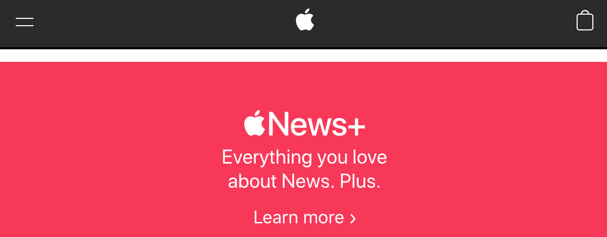

# [CSS] 레이아웃의 모든 것

Created: October 18, 2022 9:57 PM

# [CSS] Block vs Inline

## 1. Block vs Inline

Blcok 요소의 의미는, 이 요소 바로 옆(좌우측)에 다른 요소를 붙여 넣을 수 없다는 뜻
block 요소에 해당하는 태그: `<header>`, `<footer>`, `<p>`, `<li>`, `<table>`, `<div>`, `<h1>` 등이 모두 


Inline 요소는 요소끼리 서로 한 줄에, 바로 옆에 위치할 수 있다는 뜻
inline 요소: `<span>`, `<a>`, `` 태그 등





첫번째 부터 네번째 까지는 `<p>` 태그와 같은 **block 요소**이다.

block 요소들은 이런식으로 **항상 새 줄에서 시작하며 좌우로 최대한 늘어난다.**

마지막 'span의 오른쪽 정렬'이라고 작성된 것은 **inline요소**인 `<span>` 태그를 사용 했는데, 이후로 inline 성질을 가진 태그가 더 있었다면, **새로운 줄에 시작되는게 아니라 바로 오른쪽에 그려졌을 것입니다.**

결론: 홈페이지 디자인을 받아서 HTML 작업을 시작할 때, **결국은 CSS를 통해 얼마든지 성질을 바꿀 수 있다.**


## 2. inline-block

`display: inline-block;` top, buttom, margins/paddings 들을 사용할 수 있으며,  옆에 요소들을 붙여서 사용할 수있다.


## 3. none

`display: none;`  HTML은 존재하는데 화면에 보이지 않는 기능

해당 값을 사용하는 이유는,  **Javascript와 함께 사용해 interactive한 웹을 구현할 수 있기 때문이다.** 

예시로는, 검색창에 텍스트를 작성하는 순간 연간 목록이 뜨게 된다. 

해당 영역은 `display: none;` 인 값으로 실행되다가 텍스트를 입력하는 순간 (이벤트 발생시) `display: block;` 으로 교체 되면서 값이 보이게 된다. 

---

# [CSS] Position - absolute

## Position

CSS의 `position` 프로퍼티를 사용하면, html 코드와 상관없이 그리고 싶은 어느 위치에나 요소를 그릴 수  있음.


`position` 에서 사용하는 값

- `position: static;`
- **`position: relative;`**
- **`position: absolute;`**
- `position: fixed;`
</aside>

---

## 1. Position -  relative

`position: relative;` 

- 자체로는 특별한 의미가 없으며 딱히 어느 위치로 이동하지 않는다.
- **`top`, `right`, `bottom`, `left` 는 `position`이라는 프로퍼티가 있을 때만 적용되는 프로퍼티**

---

## 2. Position -  absolute

*`position: absolute;`* 

- **부모 중에 position이 relative, fixed, absolute 하나라도 있으면 그 부모에 대해 절대적으로 움직인다.**
- 일반적으로 absolute를 쓸 경우, 기준이 될 부모에게 `position: relative;` 를 부여하면 됩니다.
    - 이 경우, 부모의 크기 안에서 값이 자유롭게 정해진다.



```html
<body>
    <div class="input-wrapper">
      <input class="search-input" type="text" placeholder="검색어 입력">
      
    </div>
  </body>
```

```css
* {
  box-sizing: border-box;
}

.input-wrapper {
  width: 300px;
  position: relative;
}

.search-input {
  width: 100%;
  padding: 10px 12px;
  border: 1px solid #bbb;
  border-radius: 8px;
  font-size: 14px;
}

.glass_image {
  width: 17px;
  margin: 0;
  position: absolute;
  top: 10px;
  right: 12px;
}
```

위의 코드는 `absolute` 를 사용한 예시이다. 

1. 부모 태그  `<div class="input-wrapper">` 는 `position: relative;` 라는 값을 가지고 있다. 
2. 이미지 속의 돋보기의 위치를 배치하기 위해서는 **부모에 대해 절대적으로 움직**일 수 있도록 `position:absolute;` 를 사용해서 배치해줘야 한다. 

---

## 3. Position - fixed

`fixed`는 눈에 보이는 브라우저 화면 크기만큼, 화면 내에서만 움직인다.

이를 사용한 예시는 Apple 홈페이지의 header 이다.  스크롤을 내려도 해더는 움직이지 않는다. 




참고자료

- 위코드 Replit
- [https://www.w3schools.com/css/css_inline-block.asp](https://www.w3schools.com/css/css_inline-block.asp)