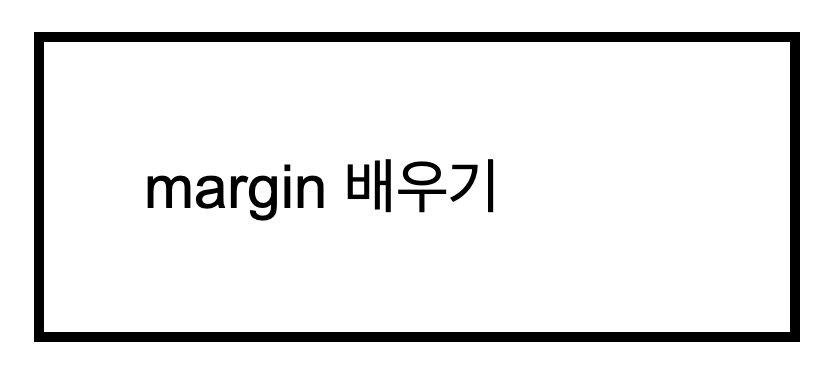
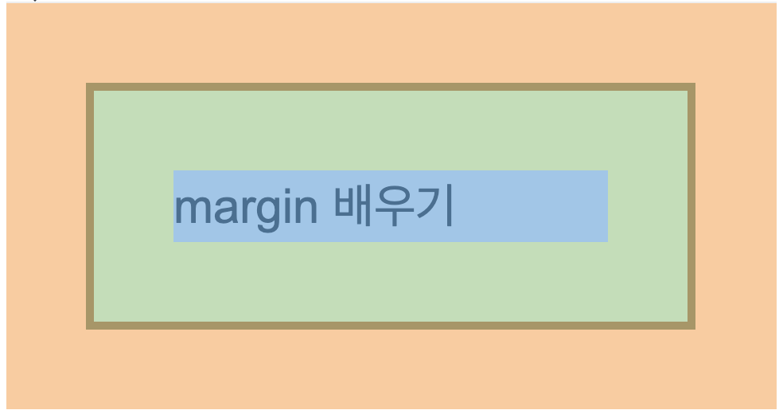
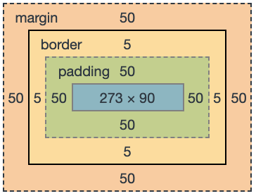
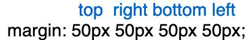

Replit 문제 풀면서 새로 알게된 개념 정리! 

# [HTML] 02. HTML tags

## 02-1. HTML 파일의 구조

html 파일의 구조는 항상 아래와 같다. 

```html
<!DOCTYPE> 
<html>
 <head>
 </head>
 <body>
 </body>
</html>
```

### 02-1-1. <!DOCTYPE\>

```html
<!DOCTYPE html>
```

HTML 파일이라면 제일 첫 줄에 위치해야 하는 선언문<br>
이 html파일이 무슨 버전의 html을 사용했는지 브라우저에 알려주는 역할을 한다.<br>
가장 최신이자 많이 쓰이는 버전은 HTML5


### 02-1-2. <html\>
```
<html></html>
``` 

모든 HTML elements(요소)들은 최상위의 요소<br>
브라우저가 html태그를 만나면, html이 시작됐는지 인지하고 요소를 그릴 준비를 한다.

### 02-1-3. <head\>

```html
<head>
  <meta charset="utf-8">
  <meta name="viewport" content="width=device-width">
  <title>repl.it</title>
</head>

```

html태그 다음에는 항상 `<head>`태그가 위치<br>
사이트의 제목, 설명, 부가 정보, 기술적 내용(ex. 이 사이트는 주로 모바일용인지)이 들어가는 부분

- `<meta charset="utf-8">` : 한글, 일본어, 중국어가 포함된 페이지라면 utf-8 이라는 값으로 문자 인코딩을 추가
- `<meta name="viewport" content="width=device-width">`: 디바이스의 가로 크기가 곧 웹 페이지의 가로와 같다는 의미, 모바일에서 웹사이트가 예쁘게 잘 보이려면 추가해야 하는 정보이다. 해당 정보를 추가하지 않으면 데스크탑 버전의 웹페이지가 축소되어 보이는 현상이 나타난다.
- `<title>repl.it</title>`: 브라우저 탭에 보이는 페이지 이름

### 02-1-4. <body\>
```
<body>></body>
``` 

body태그는 항상 head태그 다음에 위치되어 있으며,태그 내부에는 화면에 보여질 각종 태그들이 위치 레이아웃대로 배치되어 있다.

<br>

## 02-2. HTML tags

### 02-2-1. <span\>
```html
<span>이름: 김개발</span>
<span>직업: 프론트앤드 개발자</span>

>> 이름: 김개발 직업: 프론트엔드 개발자
```

- `<span>`태그에는 주로 텍스트를 넣어준다.
- `<span>`을 사용하면 줄이 바뀌지 않고, 한 줄에 이어서 나오게 된다.
- 이렇게 한 줄에 이어서 나오는 요소를 `inline-element` 라고 부른다.


### 02-2-2. <p\>
```html
<p>tag들 파헤치기!!</p>
<p>아자!!</p>

>> tag들 파헤치기!!
>> 아자!!

```

- `<p>`태그 또한 텍스트를 주로 넣어준다.
- `<p>`는 paragraph 의 줄임말인 만큼, 주로 문단을 통으로 넣을 때가 많.
- `<p>`태그는 `<span>`태그와 달리 줄바꿈이 일어난다.


### 02-2-3. <a\>
```html
<a href="https://www.w3schools.com/tags/tag_div.asp" target="_blank">a 태그?</a>
```
- `<a>`태그는 클릭하면 화면이 이동
- `<a>` 태그의 `href` 속성(`attribute`)에 이동해야 하는 주소를 작성
- `target` 속성에 *"_blank"* 값은 클릭하면 새창으로 뜨게 해주는 값입니다.
  


### 02-2-5. <div\>

`<div>`는  division의 줄임말로웹사이트에서 섹션을 나눌 때 사용하며
`<div>`는 자체로 의미가 있지는 않다.

`<div>`를 사용하는 이유는,
- 비슷한 부분끼리 그룹지어주고
- 디자인에 맞게 레이아웃을 분리해주고,
- 각 `<div>`에 `class`나 `id`라는 `attribute`를 부여하여 css 스타일을 입혀줄 수 있기 때문

<br>  

# [HTML] 03. HTML Attributes

### 03-1-1. id (고유한 값)

`id`는 각 태그에 이름을 주는 속성, 고유값<br>
따라서 웹 페이지에 해당 `id` 이름은 오직 하나만 가질 수 있다.
즉, 중복된 `id` 이름이 있으면 안된다. 


### 03-1-2. class (중복가능한 값)

`class`도 태그에 이름을 주는 속성,여러 태그에 중복된 이름을 부여할 수 있다.

```html
<div class="content-wrap"></div>
<p class="content-wrap"></p>
```

---

## 03-2. 여러 속성 추가하기

하나의 태그에 2개 이상의 속성을 부여할 수 있으며 **한 칸 띄어쓰기 후 추가**하면 된다. 

```html
<div id="profile" class="content-wrap"></div>

```
<br>

# [CSS] 04. Introduction to CSS
## 04-1. CSS(Cascading Style Sheets)

CSS란 HTML 태그들에 디자인을 입혀주는 것이다.
HTML이 헤더, 문단, 테이블 등으로 정보를 조직화하는 구조를 제공한다면, <u>CSS는 HTML이 아름다워 보이도록 스타일을 입히는 것</u>

### 04-2. **css 파일에 작성:**

html 파일과 분리하여 css파일에 따로 작성하는 방법<br>
html파일에서 어느 css파일이 쓰였는지 브라우저에 알려야 하므로, 링크를 해주는 태그를 추가해야 한다.

```html
<link href="style.css" rel="stylesheet" type="text/css" />
```

1. `link` — link태그로 사용할 css파일을 링크
2. `href` — href 속성에 css 파일 경로를 작성
3. `type` — link태그로 연결되는 파일이 어떤 것인지 알려준다. 여기서 css file을 연결하므로 type값은 항상 "text/css"
4. `rel` — rel은 HTML file과 CSS file과의 관계를 설명하는 속성이고, css파일을 링크할 때는 항상 "stylesheet"값을 대입해줍니다.


<br>

# [CSS] 07. Margin & Padding

## 07-1. Margin과 Padding

모든 요소는 아래와 같이 margin, border, padding의 스타일을 갖고 있다. 웹사이트에 요소를 배치하는데 있어서 중요한 부분!! 







위의 그림을 해석해보자면,

- 주황색은 margin 영역, 위, 오른쪽, 아래, 왼쪽에 모두 50px
- 노란색은 border 영역, 보더의 두께는 5px이다.
- 초록색은 padding 영역, 위, 오른쪽, 아래, 왼쪽에 모두 50px
- 요소의 가로는 273px, 세로는 90px


그림에서 실질적인 박스가 차지하는 너비는 `요소의 너비` + `padding`+ `border`가 합쳐진 만큼에 해당된다. 

> 실질적인 박스가 차지하는 너비: 273(요소의 너비) + 50(왼쪽 padding) + 50(오른쪽 padding) + 5(왼쪽 border) + 5(오른쪽 border) = 383


`margin`은 border 외부에 생기는 여백이다.
> 두 번째 사진처럼 margin까지(주황색) 합쳐진 너비는 총 483px

`margin`의 순서 위, 오른쪽, 아래, 왼쪽의 여백 값


`padding`은 테두리 안 쪽의 초록색 영역, 요소와 border 사이 여백

<br>

# 09. box-sizing

```css
/* 모든 태그에 프로퍼티 적용하는 경우 */ 

* {
  box-sizing: border-box;
}
```
대부분의 웹페이지에 box-sizing 프로퍼티를 기본적으로 적용

`box-sizing` :  요소의 너비와 높이를 계산하는 방법을 지정하는 속성이다. 보이는대로 width 값을 주고, 그 후에 그 안 쪽으로 padding을 주는 것과 같은 원리 ~~(padding, margin 등을 번거롭게 계산할 필요가 없음)~~

❗️개인 프로젝트나, 실무를 할 때는 꼭 적용해야하는 프로퍼티 

<br>

# 11. CSS selector

## 11-1. CSS selector

class나 id가 selector일때 태그와 결합할 수 있다.

```css
p.p-tag {
  color: gray;
}
p#third-line {
  text-decoration: underline;
}
```

첫 번째는 p태그이면서 p-tag 클래스

두 번째는 p태그이면서 third-line 아이디


```css
.pre span {
  background-color: yellow;
}
```
아래 css에서 최종적으로 적용되는 selector는 span

모든 span이 아니라 "pre" 클래스 내부에 있는 span이라는 뜻을 포함하고 있다. 요소간의 스페이스를 주목해야함 


## 11-2. CSS Specificity

selector 표현마다 우선순위가 있다.

이 우선순위는 점수 계산으로 이루어집니다.

- inline styling(13줄에 style 요소로 직접): 1000점
- id: 100점
- class: 10점
- tag: 1점

> Selector 표현 우선 순위 : tag <<<<< class <<<< id <<<<<< inline css

<br>

# 12. 이미지

## 12-1.  태그로 이미지 넣기

index.html에 이미지 몇 개 추가해 놓았습니다.

run을 눌러서 result 화면을 확인해주세요.

이미지를 웹 사이트에 추가하는 방법이 몇 개 있는데

가장 많이 쓰이는 방법은 img 태그를 사용하는 것입니다.

```html

```

img 태그에 사용된 속성을 하나씩 살펴보겠습니다.

- alt: 이미지가 뜨지 않았을 때(서버에서 이미지가 삭제됐거나 잘못된 이미지 주소일 때..), 이미지 대신 보여줄 텍스트
- src: 이미지 파일 경로 or 이미지 url 주소

첫 번째 이미지가 너무 커서 조절을 해보겠습니다.

img 태그의 속성(attribute)에는 width, height가 있어서 html에서 직접 수정 가능합니다.

하지만 유지보수나 좋은 코딩 습관을 위해 css는 항상 style.css에서 작성하는 것이 좋습니다.

```css
img {
  width: 150px;
}
```

위의 코드를 style.css에 추가해주세요.

원래 왼쪽 노란색 이미지의 크기는 344px * 390px 였고,

파란색 이미지의 크기는 512px * 512px 이었습니다.

css에 가로만 지정해주었는데 원본의 세로 값으로 남아있는 것이 아니라, 가로의 150px 비율에 맞춰서 세로도 알맞게 줄어들었습니다.

이렇게 가로/세로 중에서 하나의 값만 입력하여도

브라우저에서 알아서 같은 비율로 나머지 크기도 줄여줍니다.

## 12-2. background-image로 이미지 넣기

첫 번째 방법은 html에서  태그로 이미지를 생성하는 것이었습니다.

또 다른 방법이 있는데, 태그가 아니라 css를 이용해 이미지를 생성하는 것입니다.

즉, 사이트에 이미지가 있을 때 어떤것은 img 태그로 만들고, 어떤것은 css의 background-image 속성으로 이미지를 추가했는지 사용자는 알기 어렵습니다.

개발자도구를 열어서 직접 확인해야만 알 수 있습니다.

참고로 위의 사이트에서 상단에 있는 큰 이미지는,  태그로 넣은 것이 아니라 css를 사용하여 이미지를 넣은 것입니다.

다시 왼쪽의 index.html의 14줄과 결과화면을 함께 봐주세요.

css로 이미지를 넣어보겠습니다.

일단 이미지를 넣을 영역이 필요해서 div 태그를 하나 추가해주었습니다.

```html
<div class="bg-img">배경이미지</div>

```

결과화면을 보시면 "배경이미지"라고 텍스트가 있고 노랗고 까만 뭔가가 뒤에 깔려있습니다.

bg-img 클래스에 배경이미지를 넣는 css를 추가한 것입니다.

```css
.bg-img {
  background-color: yellow;
  background-image: url("https://upload.wikimedia.org/wikipedia/commons/thumb/6/61/HTML5_logo_and_wordmark.svg/1280px-HTML5_logo_and_wordmark.svg.png");
}
```

background-color 는 배경색을 추가하는 것이고

background-image 는 배경 이미지를 추가하는 것입니다.

background-color 를 추가하지 않으면 하얀색 바탕화면이 나와서, 영역을 한 눈에 보기 어려워서 노란색으로 칠했습니다.

더 자세히 설명해드리겠습니다.

div.bg-img에 노란 배경색을 칠했습니다.

노란색 영역, 즉 div.bg-img의 가로크기는 화면 전체이고,

세로 크기는 "배경이미지" 텍스트 높이 만큼이네요.

이것처럼 div태그는 자식태그, 즉 div태그 내부에 있는 내용이나 요소의 크기에 의해 세로가 결정됩니다.

div의 가로크기는 화면의 가로 크기만큼입니다.

이렇게 가로 전체를 차지하는 것을 block 요소라고 하며

p, header, h1 등등이 block 요소입니다.

나중에 block 요소와 inline 요소에 대해 자세히 배울 것입니다.

div태그는 자식태그나 div태그 내부에 있는 내용의 세로크기가 곧 div태그의 세로가 됩니다.

div태그의 가로크기는 div태그의 내부에 뭔가가 있기만 하면 화면 전체의 너비가 곧 자기의 가로크기가 됩니다.

그래서 div.bg-img의 노란색 배경이

가로는 화면 전체 너비만큼 칠해졌고,

세로는 딱 글씨 크기만큼 칠해진 것입니다.

div.bg-img의 내용인 "배경이미지"를 지우고 run을 클릭해 재실행 해볼까요?

네 결과 화면에서 아예 사라졌습니다.

내부에 아무것도 없어서 가로와 세로크기가 모두 0이 되었습니다.

div.bg-img의 크기는 0px*0px이 되었습니다.

다시 "배경이미지" 텍스트를 넣고 재실행 해주세요 :)

배경이미지가 짤려서 나오기 때문에

div.bg-img에 height값을 주어 배경이미지가 좀 더 잘 보일 수 있도록 하겠습니다.

.bg-img에 아래 값을 추가해주세요.

```css
.bg-img {
  height: 300px;
}
```

아무래도 가로도 너무 커서 작게 줄여야겠습니다.

아래 값을 추가해주세요.

```css
.bg-img {
  width: 300px;
}
```

그런데 div.bg-img 크기는 줄었는데 원본 이미지는 줄지 않았습니다.

네! 이미지를 담는 영역인 div.bg-img의 크기만 줄인것이고,

배경이미지의 실제 크기는 원본크기 그대로 이면서

그 중에서 div.bg-img 의 크기(300px*300px)만큼만 보여지는 것입니다.

배경이미지 크기를 div.bg-img 크기만큼 줄이려고 합니다.

해당 배경이미지가 div.bg-img의 가로크기만큼 꽉채워 그려주라는 의미입니다.

```css
.bg-img {
   background-size: 100%;
}
```

오! 드디어 이미지가 보이네요.

이제는 div.bg-img 내의 텍스트도 지우고, 노란색 배경색도 지워보겠습니다.

- div.bg-img의 내용인 "배경이미지"를 삭제해주세요.
- background-color: yellow; 노란색으로 칠한 것도 삭제해주세요.

실행해보셨나요? 네, 위의 img 태그로 사용해서 이미지를 넣은거나

css의 background-image로 이미지를 넣은거나 차이가 없어보입니다.

그리고 이제는 div.bg-img의 내용(텍스트)이 없는데도 화면에 사라지지 않았습니다.

아까는 내용(텍스트)이 없어서 자동으로 가로세로가 0px*0px 이었기 때문입니다.

현재는 css에서 가로, 세로를 고정했기 때문에

그 크기만큼 영역을 차지하고 있어서 화면에서 보이는 것입니다.


