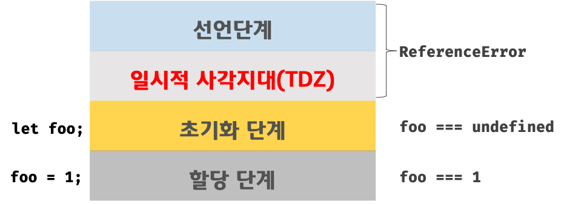

# WEEK 2 : JavaScript

# 💁🏻‍♂️ 학습 가이드

- 변수가 필요한 이유와 선언하는 방법
- 자바스크립트 데이터 타입의 종류
- `number`와 `string`의 메서드 각각 3개와 사용 방법
- 함수가 필요한 이유
- 함수의 정의와 호출의 차이점
- 조건문이 필요한 이유

---
<br>

## 변수 (variable)

- 데이터를 저장할 때 쓰이는 저장소
    
    예시)  변수 `messag`는  message 라는 이름표가 붙어 있는 상장에 “Hello!” 값을 저장
    
- 데이터에 고유의 이름인 식별자(identifier)를 명시하여 **1) 메모리에 저장된 값(데이터)를 참조(재사용)** 한다. **2)** 변수명을 통해 **코드의 가독성을 향상**시킨다.
  
<br>

### 변수의 선언

```jsx
// 변수 선언 
let name; 

// 선언만 되어 있는 변수는 undefined 초기값 
console.log(name) // undefined 

// 변수 할당 
name = 'Lee'; 

console.log(name) // 'Lee'
```

1. `let` 
    
    블록 스코프가 아닌  `var` 를 대신해서 나온 *모던 변수 선언 방식* 
    
    1. 전역변수 : 함수 밖에서 변수를 선언할 경우
    2. **블록 레벨 지역변수** : 함수 혹은 “{코드 블록} 내에 선언된 경우 
        
        ```jsx
        if (true) {
          let test = true; // 'let'으로 변수를 선언함
        }
        
        alert(test); // Error: test is not defined
        ```
        
    3. 변수 값 변경 가능 
    
2. `const`
    1. 전역변수 : 함수 밖에서 변수를 선언할 경우
    2. 블록 레벨 지역변수 : 함수 혹은 “{중괄호}” 로 둘러싸인 블록 내에서 선언된 경우 
    3. 변화하지 않는 변수 : 변수 재 선언, 재할당 불가능 
    
3. `var`  
    
    초기 자바스크립트 구현 방식으로 잘 사용하지 않는 오래된 변수 구현 방법 
    
    1. 전역변수 : 함수 밖에서 선언할 경우
    2. 함수 레벨 지역변수 : 함수 내에서 변수를 선언한 경우
        1. {블록} 밖에서 변수의 접근이 가능함 → 전역 변수의 남발 
        
        ```jsx
        if (true) {
          var test = true; // 'var'로 변수를 선언
        }
        
        alert(test); // true(if 문이 끝났어도 변수에 여전히 접근할 수 있음)
        ```
        
    3. 변수의 중복 선언을 허용하지만 의도치 않은 변수값 변경을 일으킬 수 있음  
    4. 변수 호이스팅 : 변수를 선언하기 전에 참조가 가능하다. (변수 선언 위치가 상관 없음)
   
<br>

> 🐥 Javascript에서 변수를 선언할 때 1) const를 사용한다  2) 재할당이 필요한 경우 let 키워드를 사용 3) 변수의 스코프는 최대한 좁게 생성한다.

<br>

### ➕ 변수 호이스팅

호이스팅(Hoisting)이란, var 선언문 이나 function 선언문 등을 해당 스코프의 선두로 옮기는 것 처럼 동작하는 것 

**변수 생성 과정**

1. 선언 단계 : 변수 객체에 변수 등록
2. 초기화 단계 : 등록된 변수를 메모리에 할당, undefined로 초기화
3. 할당 단계 (실제 값을 할당) 

**< `var` 선언 했을 때 일어나는 변수 호이스팅 >**

`var` 키워드로 선언된 변수는 선언단계와 초기화 단계가 한번에 이루어 진다. 변수 선언문 이전에 변수에 접근해도 에러가 발생하지 않고 **undefined를 반환** 

```jsx
// ① undefined : 변수 호이스팅으로 var foo;(선언문)이 객체에 등록
console.log(foo); 
var foo = 123;

// ② 123 : 변수의 실제 값이 할당됨 
console.log(foo); 
{
  var foo = 456;
}

// ③ 456 : 전역변수로 선언되어 값이 재할당 됨 
console.log(foo); 
```


var 키워드로 선언된 변수의 Life Cycle (출처 : Poiema web)

<br>

**< `let` 선언 했을 때 일어나는 변수 호이스팅 >**

`let` 선언문은 선언 과 초기화가 분리되어 진행되어, 두 과정 사이의 ‘일시적 사각지대(TDZ)’이 존재한다. 

```jsx
// 스코프의 선두에서 선언 단계가 실행 ->> 변수 초기화 (메모리 공간 확보)가 진행되지 않음 
console.log(foo); // ReferenceError: foo is not defined

// 변수 선언문에서 초기화 단계가 실행(메모리 공간 확보와 undefined로 초기화)
let foo; 
console.log(foo); // undefined 

// 변수 할당 
foo = 1; 
console.log(foo); // 1
```



var 키워드로 선언된 변수의 Life Cycle (출처 : Poiema web)

<br>
참고 자료 

1. [https://poiemaweb.com/es6-block-scope](https://poiemaweb.com/es6-block-scope)
2. [https://poiemaweb.com/js-data-type-variable](https://poiemaweb.com/js-data-type-variable)

---
<br>

## 자바스크립트 데이터 타입의 종류

데이터 타입(Data Type)은 프로그램이 언어에서 사용할 수 있는 데이터의 종류 

> **원시 타입**  : 변경 불가능한 값, pass-by- value
> 
> - `boolean` : true or false
> - `null` : 의도적으로 변수에 값이 없다는 것을 명시
> - `undefined` : 선언 이후 값을 할당하지 않은 변수
> - `number`
> - `string`
> - `symbol` (ES6에서 추가)
> 
> **객체 타입** 
> 
> - `object` : 이름과 값(property), 메소드(method)를 포함한 독립적 주체

<br>

### `number` 메서드

```jsx
// 다른 타입의 값을 숫자로 변환, 문자열을 숫자로 반환 
Number('123'); 

//주어진 값이 NaN인지 확인 
Number.isNaN();

//주어진 값이 유한수 인지 확인
Number.isFinite();

//주어진 값이 정수인지 확인
Number.isInteger();

//숫자형 타입을 문자형으로 변경시켜줌
Number.toString();

//소숫점자리를 반올림하여 문자열로 봔환
Number.toFixed([fractionDigits]);
```
<br>

### `string` 메서드

```jsx
// 다른 타입의 값을 문자열로 변환 
string(123); 

// index에 해당하는 위치의 문자 반환
str.charAt(0); 

//인수로 전달한 1개 이상의 문자열과 연결하여 새로운 문자열 반환
str.concat(str1[,str,...strN])

//문자 또는 문자열을 검색해서 해당 index 반환
str.indexOf(searchString);

//소문자로 변경
str.toLowerCase();

//대문자로 변경
str.toUpperCase();

```

<br>
참고 자료 

1. number 메소드 : [https://poiemaweb.com/js-number](https://poiemaweb.com/js-number)  
2. string 메소드 :  [https://poiemaweb.com/js-string](https://poiemaweb.com/js-string)

---
<br>

## 함수 (Function)

- 어떤 작업을 수행하기 위해 필요한 문(statement)들의 집합을 정의한 코드 블록
- First- class object (일급 객체) :  변수와 같이 사용할 수 있고, 코드의 어디에서든지 정의 할 수 있음
    
    > **First- class objet 란?**
    > 
    > 1. 무명의 리터럴로 표현이 가능하다.
    > 2. 변수나 자료 구조(객체, 배열 등)에 저장할 수 있다.
    > 3. 함수의 매개변수에 전달할 수 있다.
    > 4. 반환값으로 사용할 수 있다.


### 함수가 필요한 이유

1. **코드의 재사용** : 한번 선언해 놓으면 계속해서 재사용이 가능하다. 
2. 명령어의 시작과 끝을 명확하게 구분할 수 있다. 

<br>

### 함수의 구성 요소

1. input 받기
2. 기능 수행 
3. output 실행 (retrun)

<br>

### **함수 생성 : 선언 → 실행 ( = 정의 → 호출)**

```jsx
// 1. 함수 선언문 : 함수명, 매개변수 목록(parameter), 함수몸체({...})
function sayHello() {
	return ('Hello! Code Lee! 😄')
}

// 실행 및 호출 
sayHello();

// 2. 함수 표현식 (함수명을 생략하는 것이 일반적 )
var intro = function(){
		return ('Hello! Code Lee! 😄')
}

// 실행 및 호출 : 할당된 함수를 가리키는 참조값인 "변수명" 으로 호출 
console.log(intro)

// 3. Function 생성자 함수 : short-hand 
new Function(arg1, arg2,...argN, functionBody)

var square = new Function('number', 'return number * number')

// 실행 및 호출 
console.log(square(10)); // 100
```
<br>

### input이 있는 함수

매개변수는 함수 내에서 변수와 동일하게 동작한다. 

- `parameter`  : 함수를 처음 선언한 자리에 있는 input(매개변수)
- `argument` : 함수를 호출할 때 있는 input
    
    ```jsx
    // parameter = input 
    function sayHello4 (input) {
    	.... input ...
    	return output
    }
    
    // argument = 'Hi'
    sayHello4('Hi')
    ```
    
<br>

### 함수 호출

- **`Call-by-value`**  : *원시타입 인수*를 함수 매개변수로 전달 할 때 값을 복사하여 전달  → 인수 값의 변화 없음
- **`Call-by-reference`**  : *객체형 인수*를 함수 매개변수로 전달 할 때 객체의 참조값이 매개변수에 저장되어 전달 → 인수 값도 같이 변함

```jsx
function changeVal(primitive, obj) {
  primitive += 100;
  obj.name = 'Kim';
  obj.gender = 'female';
}

var num = 100;
var obj = {
  name: 'Lee',
  gender: 'male'
};

console.log(num); // 100
console.log(obj); // Object {name: 'Lee', gender: 'male'}

// 함수를 호출
changeVal(num, obj);

// 원시타입의 경우 값을 복사해서 전달함으로 함수를 적용해도 값의 변화가 없음 
console.log(num); // 100

// 객체타입의 경우 값을 저장해서 전달해 함수를 적용해 그 값도 변화됨 
console.log(obj); // Object {name: 'Kim', gender: 'female'}
```
<br>

### **함수 반환 (return)**

```jsx
// 출력 : 'Hello! Code Lee
function sayHello () {
	let friend = "Code Lee"
	console.log('Hello! ' + friend)

}

// 출력 안됨, return을 통해 결과물은 반환됨 다만 화면에 출력이 안됨
function sayHello2() {
	let friend = "Code Lee"
	return 'Return ' + friend)
)

/* 출력 : 'Return Code Lee'
	return이 있는 함수의 출력물을 확인하기 위해서는 console.log()안에 넣어줘야함 */ 
console.log(sayHellow2());

//return한 값을 변수에 할당 가능함 
let myFriend = sayHello2()
console.log(myFriend);
```
<br>

### return 과 console.log의 차이점

`return` 

- 함수의 output을 반환하는 결과물
- 배열등을 통해 여러 개의 값을 리턴할 수 있음
- 반환 생략이 가능하며, 암묵적으로 undefined 반환
- return 키워드 이후에는 함수의 실행을 중단하고, 호출한 코드로 돌아감

`console.log` 

- 단순히 화면에 출력
- 변수에 할당 불 가능

<br>

### ➕ 함수 호이스팅

- var 선언문이나 function 선언문 등 모든 선언문이 해당 Scope의 선두로 옮겨진 것 처럼 작동하는 특성
- 선언문이 선언되기 이전에 참조가 가능하다.

```jsx
// 1. 함수 선언문 : 함수 호이스팅
var res = square(5); // 함수가 정의되기 전에 함수 호출이 가능

function square(number) {
  return number * number;
}

// 2. 함수 표현식 : 변수 호이스팅이 발생
var res = square(5); // TypeError: square is not a function

var square = function(number) {
  return number * number;
}
```

→ **함수 표현식을 사용하는 것이 유리함 !!**

1. 선언문을 사용할 경우, 함수 호이스팅으로 인해 코드의 구조를 엉성하게 형성할 수 있음 
2. 인터프리터가 너무 많은 코드를 변수 객체로 저장하면 애플리케이션 응답 속도가 떨어질 수 있음 

참고 : [https://poiemaweb.com/js-function](https://poiemaweb.com/js-function)

---
<br>

## 조건문(Conditional Statement)

조건식의 평과 결과에 따라 코드 블럭의 실행을 결정하며, Boolean Type으로 평가될 수 있는 표현식 

- Boolean Type : True or False로 결과나 나오는 유형

**조건문의 시작** 

- 만약 (조건이) 참이라면 ~
- 만약 (조건문이) 거짓이라면 ~

```jsx
// 기본 조건문 : 중첨문 사용 가능 
if (조건) {
  // 조건이 true일때의 결과 값 
} else {
  // 조건이 true가 아닌 경우
}

// else if : 조건식을 추가, 여러번 사용 가능 
if (조건식 1) {
  // 조건식 1이 true일때의 결과 값 
} else if (조건식 2){
	// 조건식 2가 true 일 경우 실행 
}
else {
  // 조건식 1,2 모두 true가 아닌 경우
}

/* 삼항 조건 연산자 (Ternary Operator)
--> " 조건식 ? 조건식이 true 일때 : 조건식이 false 일 때 "
*/

var result = x % 2 ? '홀수' '짝수';
```
<br>

**Truthy & Falsy :** 불리언 값을 기대하는 문맥에서 암묵적  타입 변환 

- Truthy : 참으로 인식할 값
- Falsy : 거짓으로 인식할 값
    - false
    - undefined
    - null
    - 0, -0
    - NaN
    - ‘ ‘ (빈 문자열)

<br>

### 연산자(Operator)

1. 산술 연산자 : 수학적 계산 수행 
2. 할당 연산자 : 우항에 있는 피연산자 평가 결과를 좌항 변수헤 할당 
3. **비교 연산자** 
4. **논리 연산자** : and, or not 
<br>
  ```jsx
  // 논리합(||) 연산자
  true || true   // true
  true || false  // true
  false || true  // true
  false || false // false

  // 논리곱(&&) 연산자
  true && true   // true
  true && false  // false
  false && true  // false
  false && false // false

  // 논리 부정(!) 연산자
  !true  // false
  !false // true
  ```

<br>
참고 자료 

1. [https://poiemaweb.com/js-operator#4-삼항-조건-연산자](https://poiemaweb.com/js-operator#4-%EC%82%BC%ED%95%AD-%EC%A1%B0%EA%B1%B4-%EC%97%B0%EC%82%B0%EC%9E%90)
2. [https://poiemaweb.com/js-control-flow](https://poiemaweb.com/js-control-flow)
3. [https://developer.mozilla.org/ko/docs/Learn/JavaScript/Building_blocks/conditionals](https://developer.mozilla.org/ko/docs/Learn/JavaScript/Building_blocks/conditionals)