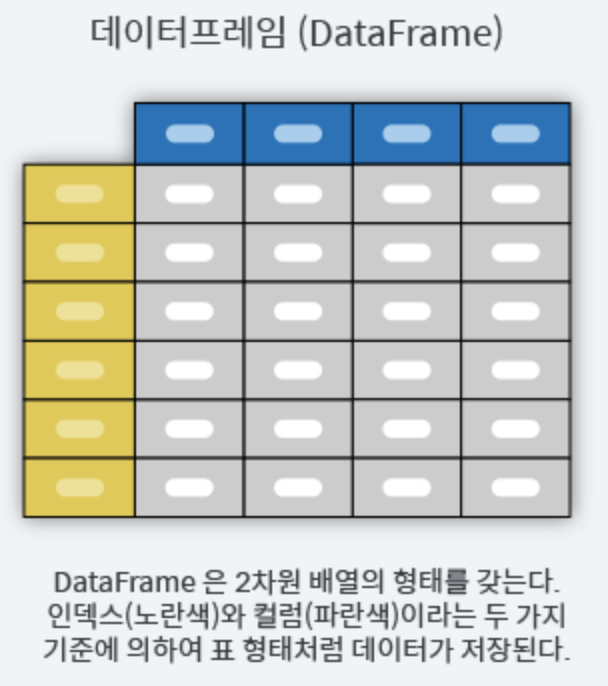
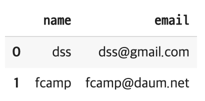

# Pandas 데이터 분석 (2)

___

### DataFrame 클래스

* 데이터 프레임은 여러개의 Series로 구성
* 2차원 행렬 데이터에 index를 부친 것과 유사 (row index, column index)
* 같은 컬럼에 있는 value값은 같은 데이터 값을 같는다 




### DataFrame 생성 1

딕셔너리의 리스트 

1. 하나의 열이 되는 데이터를 리스트나 일차원 배열을 준비 
2. 각 열에 대한 이름(라벨)을 키로 갖는 딕셔너리 생성
3. DataFrame 클래스 생성자에 넣는다 

```python
datas = {
  'name':['dss', 'fcamp'],											# 1) 하나의 열이 되는 리스트
  'email':['dss@gmail.com','fcamp@daum.net']
}				# 2) 딕셔너리 생성
columns = ['name', 'email']
df= pd.DataFrame(datas, index=['one','two'],columns=columns) # 3)생성자
df
```



### DataFrame 생성 2

리스트의 딕셔너리

```python
datas = [{'name':'dss', 'email':'dss@gmail.com'},
  {'name': 'fcamp', 'email':'fcamp@daum.net'}]
pd.DataFrame(datas)
```


#### DataFrame 속성 접근 

```python
df.values							# array 값으로 출력
```

```python
df.columns 						# 열 index 출력
```

```python
df.index							# 행 index 출력
```

```python
# Series 와 마찬가지로 이름을 붙일 수 있다

df.index.name = "도시"
df.columns.name = "특성"
df
```

```python
df.T 								# numpy 2차원 배열 속성, 메서드 지원 
```


### 열 데이터의 갱신, 추가, 삭제

- series의 갱신, 추가, 삭제와 동일 


### 데이터 프레임에서 데이터 선택

___

#### 열 인덱싱 (indexing)

- 열 라벨(column label)을 키 값으로 생각하여 인덱싱

- 인덱스를 라벨 값을 하나만 넣으면 **시리즈**로 반환

  ```python
  # 하나의 열만 인덱싱하면 시리즈가 반환된다.
  df["지역"]
  ```

  ```
  도시
  서울    수도권
  부산    경상권
  인천    수도권
  대구    경상권
  Name: 지역, dtype: object
  ```

* 라벨의 배열 또는 리스트를 넣으면 **부분적인 데이터프레임**을 반환

  ```python
  # 여러개의 열을 인덱싱하면 부분적인 데이터프레임이 반환된다.
  df[["2010", "2015"]]
  ```

  

* 문자열 라벨을 가지고 있는 경우, '정수 인덱스'를 열 인덱싱에 사용 할 수 없다. 단, 우너래부터 정수형 열 인덱스를 가진 경우에는 표기 가능

  

#### 행 인덱싱(indexing)

* 행 단위 인덱싱 = Slicing

  ```python
  df[1:3]
  ```

  

  ```python
  df["서울":"부산"]
  ```

  

#### 개별 데이터 인덱싱

```python
df['열 label']['행 label']
```


### 고급 인덱싱

* **loc** : **라벨(row)** 기반의 2차원 인덱싱

  ```python
  df.loc[행 인덱싱 값, (열 인덱싱값)]
  ```

  * 인덱싱 값을 **하나**만 받는 경우 - **row(행)을 선택**

    * 행값 가져오기, 슬라이싱, 리스트, 불리언  시리즈

      ```python
      # 불리언 시리즈
      df.A > 15
      ```

      ```
      # 불리언시리즈 행을 선택하는 인덱싱
      df.loc[df.A >15]
      ```

    * 원래 행(row)인덱스 값이 정수인 경우에는 '슬라이스의 마지막 값이 포함된다'

      ```python
      df2.loc[1:2]						# index 1-2번 출력
      ```

  * 인덱싱 값을 **행과 열 모두** 받는 경우 : `df.loc[행 인덱스, 열 인덱스]`

    * 행 인덱스 라벨 값이 a, 열 인덱스 값이 A인 위치의 값을 구하는 것 

      ```python
      df.loc['a','A']
      ```

    * 슬라이싱, 리스트, 불리언시리즈 가능

      ```python
      df.loc['b':,'A']							# b행 부터 끝까지, A열의 값
      ```

      

* **iloc**: 순서를 나타내는 **정수** 기반의 2차원 인덱싱 

  ```
  df.iloc[행 인덱싱 값, (열 인덱싱값)]
  ```

  * 인덱싱 값을 **행과 열 모두** 받는 경우

  ```python
  df.iloc[0,1]
  ```

  ```python
  df.iloc[0, -2:]								# 0번째 행, -2열 부터 끝까지의 값
  ```

  * 인덱싱 값을 **하나**만 받는 경우 : **row(행)**

  ```python
  df.iloc[-1]
  ```

  

##### 참고자료

* [데이터사이언스스쿨](https://datascienceschool.net/01%20python/04.01%20%ED%8C%90%EB%8B%A4%EC%8A%A4%20%ED%8C%A8%ED%82%A4%EC%A7%80%EC%9D%98%20%EC%86%8C%EA%B0%9C.html)
* 사진  : [github](https://dandyrilla.github.io/2017-08-12/pandas-10min/)
  