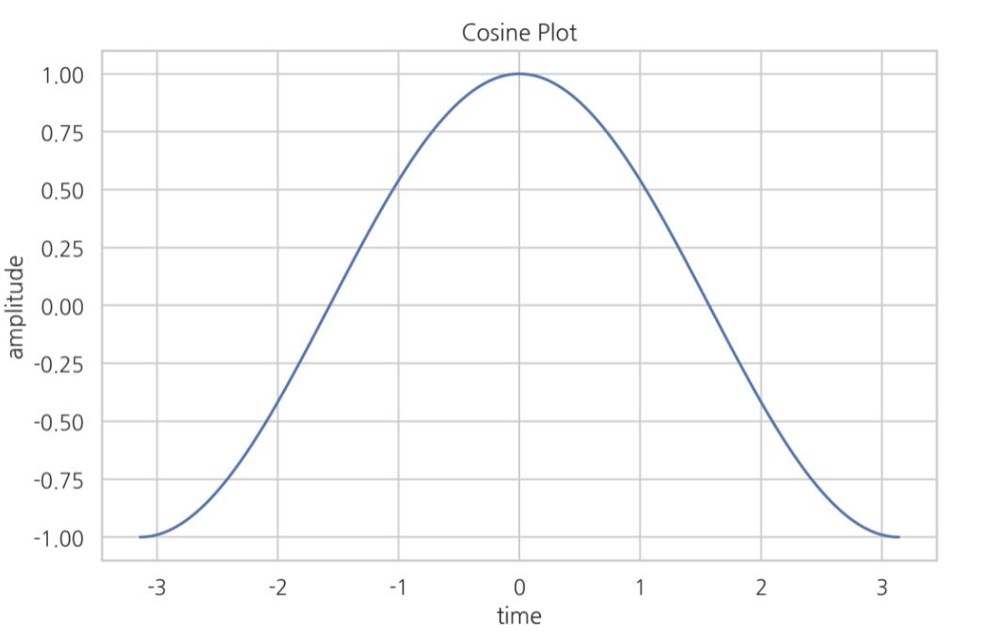
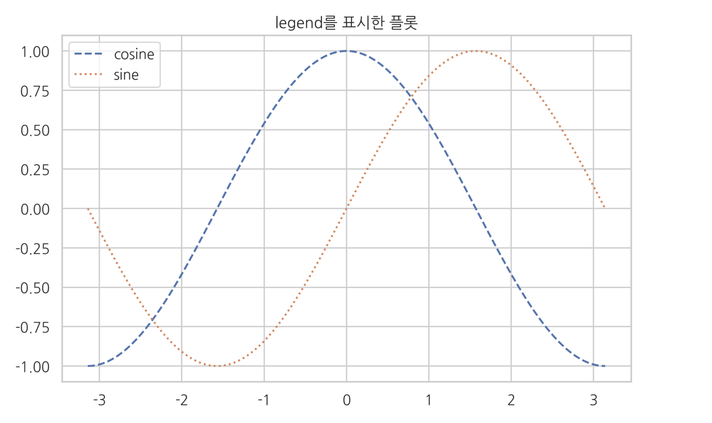
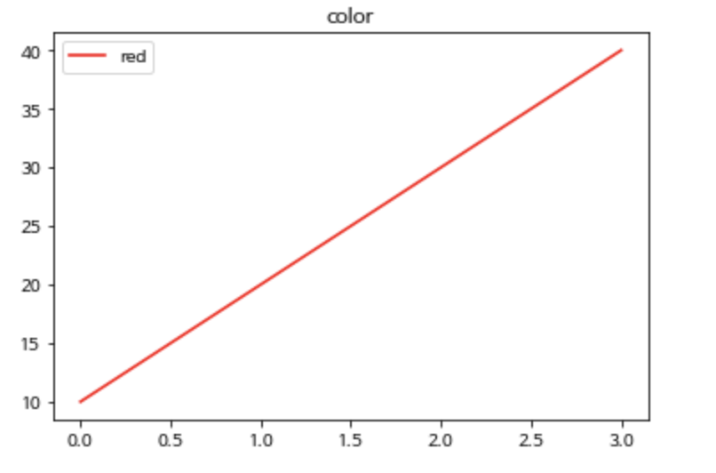
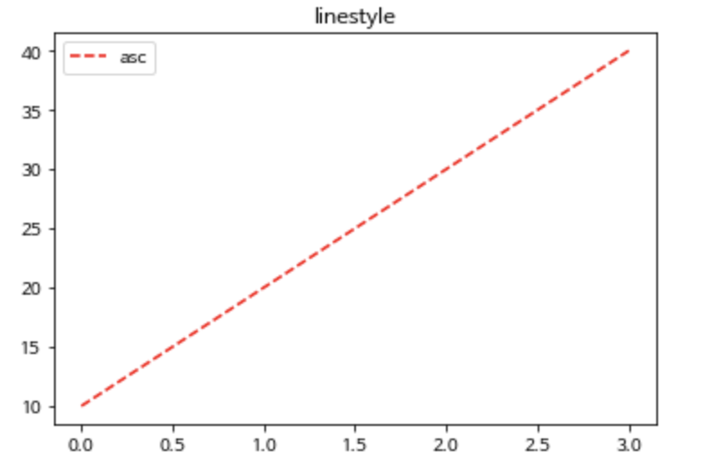
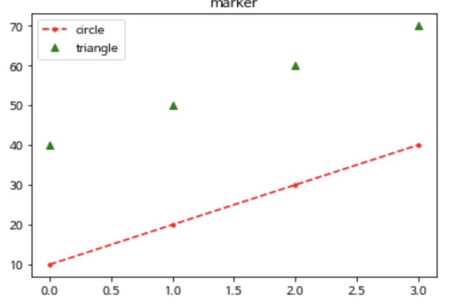
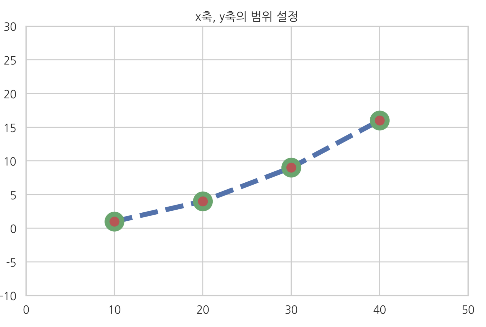
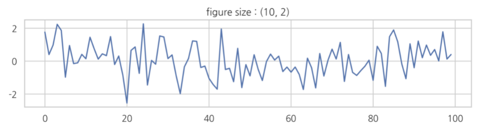
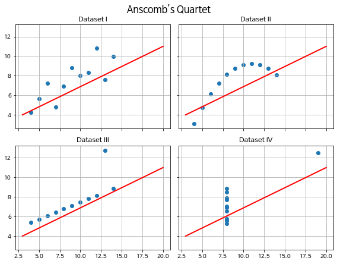

# 데이터 시각화

___

## Matplotlib

- 파이썬으로 데이터를 시각화 하는데 matplotlib  라는 라이브러리를 가장 많이 사용한다. 
- 2D  형태의 그래프, 이미지 등을 그릴 때 사용 
- [matplotlib 홈페이지](https://matplotlib.org)

### matplotlib 불러오기

```python
import matplotlib.pyplt as plt
```


### 기본 그래프 그리기= plot()

* plot() 함수는 **직선** 또는 **꺾은 선 형태의 그래프**

  ```python
  import matplotlib.pyplt as plt
  plt.plot([x축 데이터],[y축 데이터])
  plt.show()
  ```


### 그래프에 옵션추가하기

____

#### 1. 그래프에 제목 넣기

*  plt.title('제목에 넣을 문자열')

* x 축과 y축 위치에 각 데이터 label 지정이 가능하다

* **xlabel. ylabel**

  ```python
  X = np.linspace(-np.pi, np.pi, 256)
  C, S = np.cos(X), np.sin(X)
  plt.plot(X, C, label="cosine")
  plt.xlabel("time")									# x 축
  plt.ylabel("amplitude")							# y 축
  plt.title("Cosine Plot")
  plt.show()
  ```

  

#### 2. 그래프의 '범례' 넣기

1. plt.plot([x축 데이터],[y축 데이터], **label= 레이블 값** )

2. 범례 표시: plt.legend()

3. (필요시) 범례의 위치를 직접 지정하기 

   * plt.legend(loc= 숫자)

   ```python
   X = np.linspace(-np.pi, np.pi, 256)
   C, S = np.cos(X), np.sin(X)
   plt.title("legend를 표시한 플롯")
   plt.plot(X, C, ls="--", label="cosine")			# 여러개의 선을 그리기, 범례표시
   plt.plot(X, S, ls=":", label="sine")
   plt.legend(loc=2)
   plt.show()
   ```

   


#### 3. 그래프 색상 바꾸기

* plt.plot([x축 데이터],[y축 데이터], label=레이블 값, **color= 원하는 색상**)

* [참고자료](https://matplotlib.org/2.0.2/examples/color/named_colors.html)

  ```python
  plt.title('color')
  plt.plot([10,20,30,40], label= 'red', color='red')
  plt.legend(loc=2)
  plt.show()
  ```



#### 4. 그래프 선 모양 바꾸기

* plt.plot([x축 데이터],[y축 데이터], label=레이블 값, color= 원하는 색상, **linestyle = '--'**)

* linestyle 은 'ls'로 생략 가능

* plt.plot([x축 데이터], '<색상><선모양>') 가능 

  ```python
  plt.title('linestyle')
  plt.plot([10,20,30,40], label= 'asc', color='red',ls='dashed')
  #plt.plot([10,20,30,40], label= 'asc','r--')
  plt.legend(loc=2)
  plt.show()
  ```



#### 5. 마커 모양 바꾸기

* plt.plot([x축 데이터],[y축 데이터], label=레이블 값, color= 원하는 색상, linestyle = '--', **marker= 원하는 마커**)

* 선, 점, 동그라미, 삼각형, 별 모양등 다양한 종류가 있음 

* 예 ) '.' = 점 모양 ,  '^'=삼각형

  ```python
  plt.title('marker')
  plt.plot([10,20,30,40],'r.--',label='circle')
  plt.plot([40,50,60,70], 'g^', label='triangle' )
  plt.legend(loc=2)
  plt.show()
  ```



#### 6. 그림 범위 지정

* 그림의 범위 경계선에 있어서 잘 보이지 않는 경우, 그림의 범위를 수동으로 지정하여 변경할 수 있음

* **xlim**  과 **ylim** 명령어 사용

  ```python
  plt.title("x축, y축의 범위 설정")
  plt.plot([10, 20, 30, 40], [1, 4, 9, 16],
           c="b", lw=5, ls="--", marker="o", ms=15, mec="g", mew=5, mfc="r")
  plt.xlim(0, 50)						# x 축 범위 지정
  plt.ylim(-10, 30)					# y축 범위 지정
  plt.show()
  ```




#### 7. 틱 설정

* 플롯이나 차트에서 축상의 위치 표시 지점 = tick(틱)

  ```python
  X = np.linspace(-np.pi, np.pi, 256)
  C = np.cos(X)
  plt.title("x축과 y축의 tick label 설정")
  plt.plot(X, C)
  plt.xticks([-np.pi, -np.pi / 2, 0, np.pi / 2, np.pi]) 
  plt.yticks([-1, 0, +1])
  plt.show()
  ```

  


### 그림의 구조

___

* Matplotlib 가 그리는 그림은 **Figure, Axes, Axis** 객체로 구성됨


#### 1. Figure 객체

* 모든 그림은 Figure 객체, 그림이 그려지는 캔버스나 종이

* 1개 이상의 Axex 객체를 포함하고 있다

* plot 명령에 포함되어 자동 실행되는 경우가 많음 

  * 사용예시 ) 그림의 크기를 설정하고 싶을 때 = `figsize`

    ```python
    np.random.seed(2021)
    f1 = plt.figure(figsize=(10, 2))		# 그림의 크기를 설정 
    plt.title("figure size : (10, 2)")
    plt.plot(np.random.randn(100))
    plt.show()
    ```

    

#### 2. Axes 객체와 subplot 명령

* 두개 이상의 Axis 객체를 포함 , 하나의 plot 

* 하나의 캔버스에 여러개의 그림을 그리는 것과 유사, Figure안의 각각 plot 은 axes 

* **subplot** 명령어를 사용하여 Axes 객체를 얻어야한다.

  ```python
  # subplots()명령어 사용하여 객체 그리기 
  fig, axes = plt.subplots(2,2, figsize=(8,6), 
                           sharex=True, sharey=True)
  
  for i,roman in enumerate(['I', 'II', 'III', 'IV']):
    ds= ans[ans.dataset == roman]
    ax= axes[i//2, i % 2]
    ax.scatter(ds.x, ds.y)
    ax.plot([3,20], [4, 11], 'r-', lw=2)
    ax.set_title(f'Dataset {roman}')
    ax.grid()
  
  fig.suptitle("Anscomb's Quartet", fontsize=16, y=1.02)
  plt.tight_layout()
  plt.show()
  ```

  


#### 3. Axis 객체와 축

* Axis 객체는 plot의 가로축이나 세로축


##### 참고자료

* 모두의 데이터 분석 with 파이썬 (송석리, 이현아 지음), unit 04

* [데이터사이언스스쿨](https://datascienceschool.net/01%20python/05.01%20%EC%8B%9C%EA%B0%81%ED%99%94%20%ED%8C%A8%ED%82%A4%EC%A7%80%20%EB%A7%B7%ED%94%8C%EB%A1%AF%EB%A6%AC%EB%B8%8C%20%EC%86%8C%EA%B0%9C.html)

  