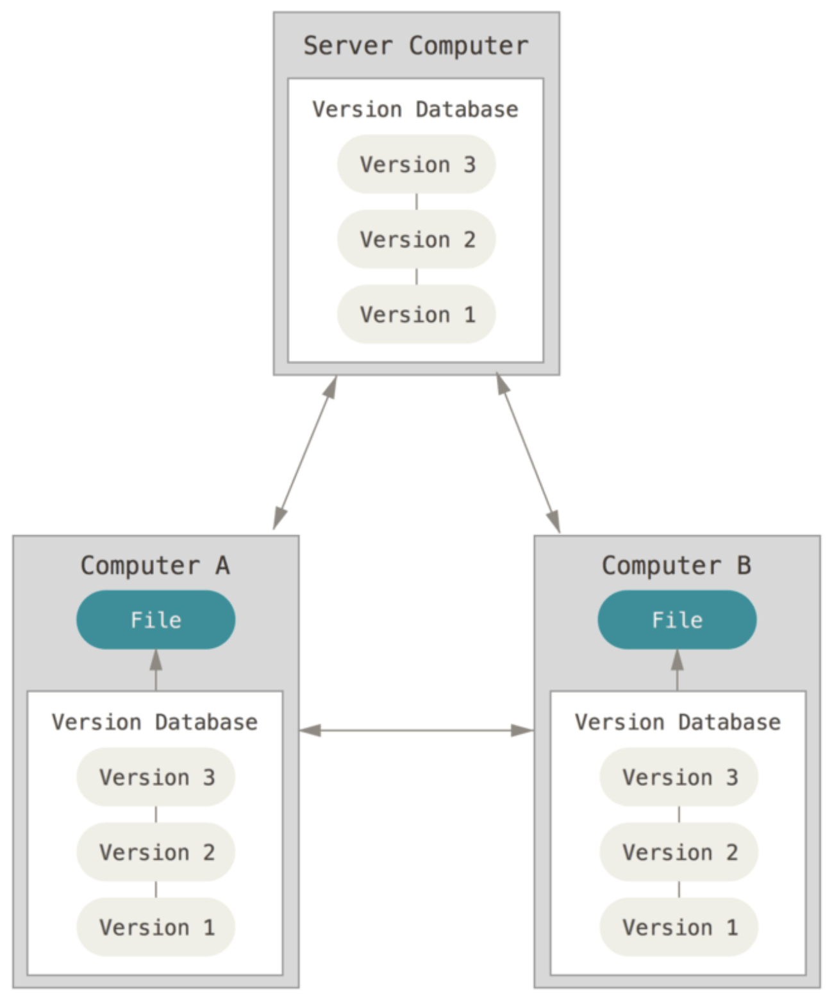

# Git 기초흐름

___

#### Git 이란?

- Git은 **분산버전관리시스템** 으로 코드의 버전을 관리하는 도구
- 리누스 토르발스가 개발
- 컴퓨터 파일의 변경사항을 추적하고 여러명의 사용자들 간에 해당 파일들의 작업을 조율

#### 분산버전관리시스템(DVCS)

- 중앙집중식버전관리시스템은 중앙에서 버전을 관리하고 파일을 받아서 사용

- **원격저장소(remote repository)**를 통하여 협업하고, 모든 히스토리를 클라이언트들이 공유

  

### git 기본 흐름

1) **기본 flow**
   1) 작업(수정)한 파일 (working directory)
   2) **add** 하여 Staging area에 모아
   3) **commit**으로 버전 기록 (Head)

2. **Git 파일 관리**

   * modified : 파일이 수정된 상태 (add 명령어를 통하여 string area로)
   * staged : 수정한 파일을 곧 커밋할 것이라고 표시한 상태
   * commited : 커밋이 된 상태

3. **파일 라이프사이클**

   * **Tracked** : 이전부터 버전으로 관리되고 있는 파일

     * unmodified : git status 에 나타나지 않음
     * modified : *"Changes not staged for commit"*
     * Staged : *"Changes to be commiteted"*

   * **Untracked**  : 버전으로 관리된 적 없는 파일 

     

   