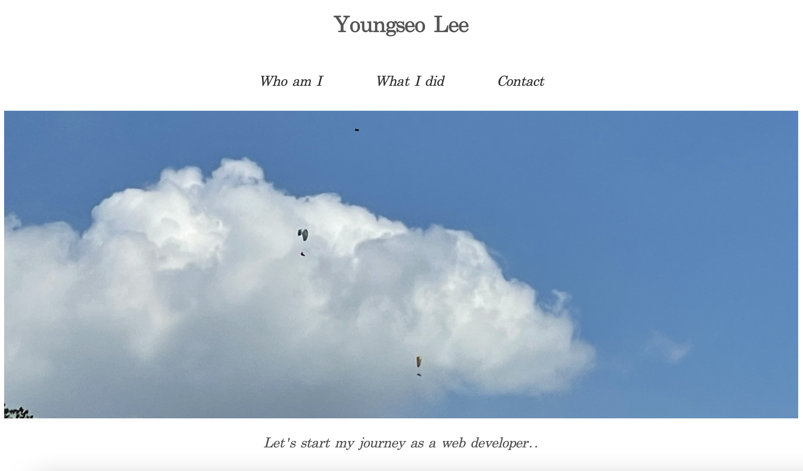
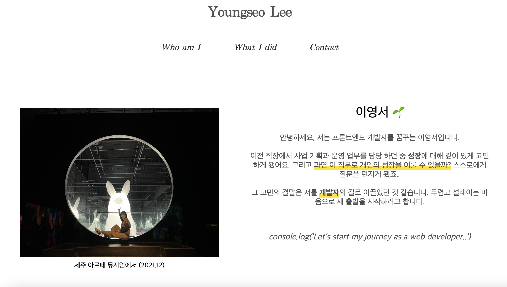

나의 첫 회고록 ,, 

위코드 사전스터디 1주차 과제인 '자기소개 페이지 만들기'를 완료하고 그 기록을 남겨보려고 한다. 
___
<br>

**자기소개 페이지로 이동:** 
[🐣Youngseo Lee](https://seoya0512.github.io/main.html)

### <span style = "color:#4D4F56 ">1. 기간 </span>
9/7(수) ~ 9/14(수), 7일 

### <span style = "color:#4D4F56 "> 2. 프로젝트 목표 </span>
HTML 과 CSS 기초를 학습하고 적용해 웹사이트 만들기

### <span style = "color:#4D4F56 "> 3. 기술스택 </span> 
Figma(디자인 기획) HTML, CSS 
<br>

### <span style = "color:#4D4F56 "> 4. 작업 순서 </span>
1. Figma를 활용해 웹페이지 구성 및 디자인 구상 
2. HTML 과 CSS 를 활용해 웹사이트 구축 
3. Github Hosting을 통해 웹사이트 호스팅
   - 참고 사이트: [WEB1 - 18. 웹호스팅 : github page](https://www.youtube.com/watch?v=n1wvs7xuUYk&list=PLuHgQVnccGMDZP7FJ_ZsUrdCGH68ppvPb&index=19&ab_channel=%EC%83%9D%ED%99%9C%EC%BD%94%EB%94%A9)

<br>



### 배운점 
1. `float` 의 속성 : HTML요소가 주변의 다른 요소들과 자연스럽게 어울리도록 설정해준다.
<br>


- 사진 좌측에 텍스트가 배치될 수 있도록 `float: left` 속성을 사용함

2. `div` 혹은 단락 구분의 중요성 
<br>
div는 html에서 단락을 나눠주는 중요한 역할을 하는데 큰 뜻은 없으면서 큰 역할을 한다. 어떻게 묶어 주느냐에 따라 **페이지의 구조**가 변한다.


<br>

```html
<!-- Heading,img,text세트의 div 구조-->
    <div class=" wrapper">
      <h3>Academic</h3>
      <div class="container">
          
          <div class="overlay">
              <div class="text"> 
                학위: Bachelor of Science <br><br>
                단과대학: College of Engineering and Applied Sciences <br><br>
                전공: 기술경영 (Technological Systems Management)</div>
          </div>
          <h5>State University of NewYork, StonyBrook</h5>
      </div>
    </div>
```
<br>
"What I did" 페이지는 4개의 column 으로 나눠져있고 각각의 영역은 heading, img, text 등이 포함되어 있다. 각각의 column은 여러개의 div로 나눠져있다. 

   1. 모든 구성요소를 묶어주는 wrapper 
   2. 이미지 + overlay를 포함하는 container
   3. overlay안에 들어가는 text 

over-lay가 자꾸 다른 영역을 침범해 여러 코드를 시도했지만 실패했고 이후 필요 없는 div는 정리하고 순서를 정리하니 해결 완료!! <br>

### 아쉬운점, 보완하고 싶은 점 

1. What I did 페이지 `Display : flex;` 사용하기 

2. header, menu bar 등의 고정 속성은 import 가능한지 확인

3. Javascript를 추가한 동적 웹사이트 구축 


### 느낀점 
이번 프로젝트를 진행하면서 웹 페이지의 근본이 되는 HTML과 CSS에 대해 학습하게 됐다. 이전에 html을 학습한 이유는 `데이터수집`의 목적이었다면, 이번에는 메인 기술로서 사용한다는 점이 색다르게 다가왔다. <br>
HTML과 CSS는 어려운 문법은 큰 틀과 구성을 이해하면 어렵지 않다고 생각이 들고, 구글 선생님을 많이 찾아보고 직접 코드를 치면서 문법을 익혀가는 것이 더 좋은 방법 인것 같다 😀